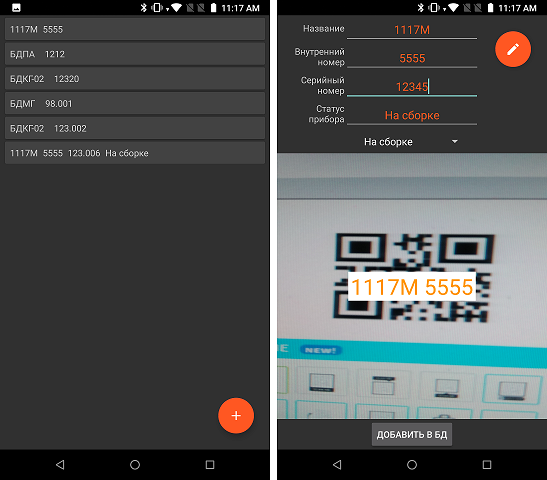

# AdjustmentDB 1.31
### <i>Облачная база данных для УРиР. Мониторинг статуса устройств (на линейке, готов и т.д.). Запись данных по QR-коду.</i> 

Особенности:
- Для хранения данных используется облачная NoSQL база данных Firestore Database. Cloud Firestore кэширует данные, которые активно использует ваше приложение, поэтому приложение может записывать, читать, слушать и запрашивать данные, даже если устройство отключено. Когда устройство возвращается в режим онлайн, Cloud Firestore синхронизирует любые локальные изменения с Cloud Firestore. 
- Для просмотра (чтения) данных используется как Web интерфейс (AdjustmentWeb), так и Android приложение (AdjustmentDB) 
- Запись данных в базу данных возможна <i>только</i> используя Android приложение и <i>только</i> предварительно отсканировав через это приложение QR-код, наклеенный на прибор. Таким образом изменить / добавить данные для устройства можно <i>только</i> непосредственно имея это устройство в наличии  
- Также исключена возможность добавить / изменить данные, используя нелегальный QR-код, сгенерированный не через специальное приложение (на данный момент генератор является частью AdjustmentWeb). Это обеспечивается шифрованием строки для QR-кода на этапе его генерации: для корректной генерации необходимо добавить ключ безопасности в окне генерации кода — некорректный ключ приведет к некорректной генерации кода. Сам ключ находится только у специалиста, который занимается изготовлением наклеек с QR-кодом (позже, скорее всего, будет сделано специальное приложение для генерации QR-кода, использовать ключ уже не будет необходимо)     
- Так как данные для всех приложений являются общими, то любое изменение данных немедлено отобразится на всех приложениях, как Web, так и Android   
- Любые списки, используемые в приложениях (например список названий статусов для ремонтных или для серийных приборов, или список названий устройств) не хранятся в самих приложениях, а находятся в базе данных и отслеживаются специальными лисенерами. Таким образом, во всех приложениях используются одинаковые списки, в независимости от типа или версии приложения. Если нужно будет добавить или изменить элемент любого списка, этот элемент будет добавлен разработчиком в базу данных, после чего этот элемент немедленно автоматически добавится во всех приложениях, как Web, так и Android, без необходимости их обновления до последней версии  
    

[Список версий](./VERSION.md)

[Скачать .apk последней версии - 1.27](./AdjustmentDB-v1.27.apk)

